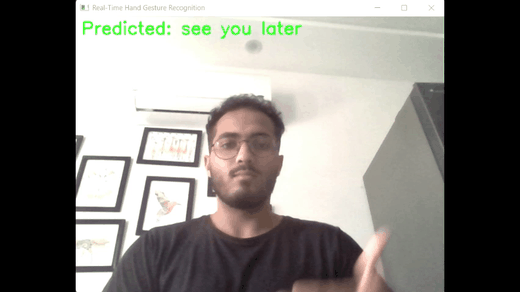
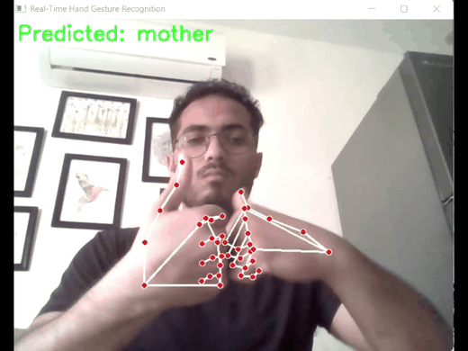
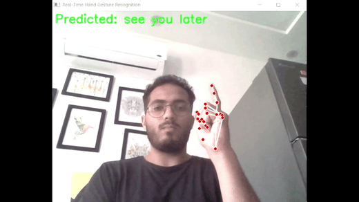
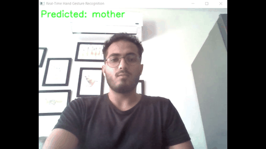

# Sign Language Translator

Realtime sign language recognition and communication platform with Arabic/English interfaces, live camera translation, text-to-GIF/video conversion, and chat features.


## Demo Videos

These demos are shown as inline GIF previews. Click any preview to open the full MP4.

### Demo Gallery (2x2)
<table>
  <tr>
    <td>
      <strong>Help</strong><br/>
      <a href="demo/help.mp4"></a><br/>
      <a href="demo/help.mp4">Open file</a>
    </td>
    <td>
      <strong>How</strong><br/>
      <a href="demo/how.mp4"></a><br/>
      <a href="demo/how.mp4">Open file</a>
    </td>
  </tr>
  <tr>
    <td>
      <strong>Mother</strong><br/>
      <a href="demo/mother.mp4"></a><br/>
      <a href="demo/mother.mp4">Open file</a>
    </td>
    <td>
      <strong>See You Later</strong><br/>
      <a href="demo/see%20you%20later.mp4"></a><br/>
      <a href="demo/see%20you%20later.mp4">Open file</a>
    </td>
  </tr>
</table>

## Overview

This project combines:

- Real-time hand landmark detection (MediaPipe)
- Deep-learning sign classification (TensorFlow/Keras models)
- Flask + Socket.IO web app for live video processing
- Arabic and English user experiences (separate templates/routes)
- Text-to-sign media generation using GIF and ASL video assets

It is designed for interactive communication workflows (live signing, chat, and media-based sign output).

## Key Features

- **Realtime sign detection:** webcam frame processing through Socket.IO namespace `/video`
- **Arabic and English modes:** mirrored routes/templates for both language flows
- **Text to sign output:**
  - Arabic: GIF-based output from static assets
  - English: ASL GIF/MP4 generation and concatenation
- **Authentication and social layer:** signup/login, friends, messaging, chat pages
- **Fallback behavior:** app can still run when some model files fail to deserialize
- **Docker support:** `Dockerfile` + `docker-compose.yml`

## Tech Stack

- Python, Flask, Flask-SocketIO, Flask-Session
- TensorFlow / Keras, MediaPipe, OpenCV
- scikit-image, scikit-learn, joblib
- Firebase Admin SDK (auth + firestore usage in app flow)
- HTML templates + static assets

## Project Structure

```text
sign-language-translator/
├── app.py
├── realtime_sign.py
├── asl_model_detection.py
├── docs/
├── scripts/
├── models/
├── templates/
├── static/
│   ├── asl_videos/
│   └── ...
├── gif_ASL/
├── Uploads/
├── requirements.txt
├── run_app.cmd
├── Dockerfile
└── docker-compose.yml
```

## Important Model / Asset Files

The app expects trained assets in `models/`, including:

- `models/action3.h5`
- `models/asl_model_efficientnetb000.h5`
- `models/mobilenet_arabic_sign_model.h5`
- `models/svm_asl_model.joblib`
- `arial.ttf`
- Firebase service account JSON file used by `app.py`

If some model files are incompatible with your local TensorFlow/Keras version, the server may still run with fallback behavior (reduced prediction capability).

## Prerequisites

- Windows 10/11 recommended (project currently tuned for Windows workflows)
- Python 3.10+ (project venv currently uses 3.10 in this repo)
- Webcam for live sign detection
- Git

## Quick Start (Windows - Recommended)

### 60-Second Start

```bat
python -m venv sign_lang_env
sign_lang_env\Scripts\activate
run_app.cmd
```

Then open:
- `http://localhost:5001`
- or `https://localhost:5001` (recommended for full camera permissions)

### Full Windows Setup

1. Create/ensure virtual environment folder named `sign_lang_env`.
2. Run:

```bat
run_app.cmd
```

`run_app.cmd`:

- upgrades pip/setuptools/wheel
- installs pinned dependency chunks
- starts server on `http://localhost:5001`

## Manual Start (Alternative)

```bash
python -m venv sign_lang_env
sign_lang_env\Scripts\activate
pip install -r requirements.txt
python app.py --host localhost --port 5001
```

For camera reliability in browsers, use HTTPS mode when needed:

```bash
python app.py --https
```

## Docker

Build/run with compose:

```bash
docker-compose up --build
```

Default exposed app port: `5001`.

## Main Routes

Core pages:

- `/`
- `/ARhome`, `/ENhome`
- `/video`, `/ENvideo`
- `/test-video`, `/ENtest-video`
- `/ARlogin`, `/ENlogin`, `/ARsignup`, `/ENsignup`
- `/chats`, `/ENchats`
- `/feedback`, `/ENfeedback`

Socket events are handled under namespace `/video` (frame streaming, signaling, translation, GIF/video generation).

## Camera Notes

- Prefer `https://localhost:5001` for full browser camera permissions.
- On Windows, verify camera access in:
  - Settings -> Privacy -> Camera
  - Browser site permissions
- See `docs/CAMERA_TROUBLESHOOTING.md` for full diagnostics.

## ASL Video / GIF Setup

- English ASL setup: `docs/ASL_SETUP_README.md`
- English integration details: `docs/ENGLISH_INTEGRATION_README.md`
- Required ASL source list: `static/asl_videos/required_videos.txt`

## Known Notes

- Some environments may show dependency resolver warnings due to protobuf/jax/tensorflow ecosystem constraints.
- Some legacy model files may raise Keras deserialization warnings/errors depending on local versions.
- App startup should continue when fallback paths are available.

## Security and Configuration

Before publishing/deploying:

- rotate any API keys/service-account secrets
- avoid committing private credentials
- move secrets to environment variables for production

## Contributing

1. Fork the repository
2. Create a feature branch
3. Commit changes with clear messages
4. Open a pull request

## License

Add your preferred license file (`LICENSE`) and update this section accordingly.